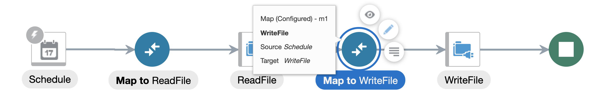

# How to Read a CSV File using a Different Delimiter

## Introduction

In this guide, I will show how to read a CSV file using a different **column** delimiter than the presets available on the OIC FTP adapter. These are the space, comma, semicolon, tab, and pipe characters ` ,;	|`. Each (column) field may be optionally enclosed by these characters: double quote, single quote, parentheses, square bracket, curly brace, angle bracket, or pipe characters `"'()[]{}<>|`. Finally, each row is terminated by the END_OF_LINE character, newline, carriage return, or both `${eol}` `\n` `\r` `\r\n`.

Normally, a CSV file will use commas, double quotes, and `${eol}` as its column delimiter, quotation character, and row delimiter: `person.csv`
```
Fname,Lname,email,phone,BID
Alice,Sundayala,alice.sundayala@email.com,3004005000,1
Brent,Markleson,brent.markleson@email.com,1002003000,1
Craig,Stromdell,craig.stromdell@email.com,3101234567,4
Dylan,Renderman,dylan.renderman@email.com,8857713312,2
Ellie,Heartford,ellie.heartford@email.com,3005006000,1
Franz,Guillermo,franz.guillermo@email.com,1311411511,3
Grant,Zapanicca,grant.zapanicca@email.com,3104456667,4
Haley,Riverbend,haley.riverbend@email.com,8851357900,2
```
In this guide, I will be showing two methods to transform this CSV file into the above: `personhash.csv`
```
Fname#Lname#email#phone#BID
Alice#Sundayala#alice.sundayala@email.com#3004005000#1
Brent#Markleson#brent.markleson@email.com#1002003000#1
Craig#Stromdell#craig.stromdell@email.com#3101234567#4
Dylan#Renderman#dylan.renderman@email.com#8857713312#2
Ellie#Heartford#ellie.heartford@email.com#3005006000#1
Franz#Guillermo#franz.guillermo@email.com#1311411511#3
Grant#Zapanicca#grant.zapanicca@email.com#3104456667#4
Haley#Riverbend#haley.riverbend@email.com#8851357900#2
```
where the column delimiter has been replaced by a hash symbol `#`.

## Disclaimer

This guide is not meant to be a best-practice guide for performing mutations to CSV files. It is only meant to show the out-of-the-box capabilities of OIC's XSLT transformations. ***The best practice in OIC would be to optionally move the CSV file to a new storage location and invoke a third-party function that performs the required transformations before continuing downstream processing***.

## Auxiliary Information

This guide was written between November 22, 2021 and December 1, 2021. The version of OIC that was used to create these integrations was version 21.4.2.

## Assumptions

This guide assumes the following:
- The CSV file originates from a file server and is accessed via the FTP adapter.
- The file used in [Method 1](#method-1-change-entire-row) and [Method 2](#method-2-map-parsed-row-to-individual-target-elements) does NOT contain delimiter characters that you will be using to replace the existing delimiter characters. For instance, if you wish to replace `A#B#C#D#E, Euler's Number\r\n` with `A,B,C,D,E, Euler's Number\r\n` the extra comma before ` Euler's` will result in this row of data having six fields instead of five. For a more detailed discussion on how to handle these situations, see [this section](#advanced-methods-for-parsing-existing-delimiter-characters).
- Certain XSLT functions mentioned in this guide such as `oraext:create-delimited-string` are shortened to `create-delimited-string` (i.e. namespace removed).

## Prerequisites

Please make sure you understand the following concepts prior to reading this guide. The details for performing the following will not be written in this guide.
- How to provision and administer your OIC instance
- How to navigate to your OIC homepage
- Where to create connections
- Where to create integrations
- How to activate/deactivate integrations
- Where to monitor integration jobs

This guide is meant for **somewhat experienced OIC users**, meaning users know how to do each of the above and have done them at least once.

In addition, it is recommended that the consumer of this guide has familiarity working with the FTP adapter and the XSLT mappings (i.e. knows what they are and where to find them). If you do not have access to an FTP server, you may create a file server as detailed [here](https://docs.oracle.com/en/cloud/paas/integration-cloud/file-server/enable-file-server.html). To access your FTP server, you may use third-party software such as WinSCP (Windows), FileZilla, Cyberduck, etc.

# Methods

Prior to implementing either of these methods, you will need to create the FTP connection first.

## Create the FTP Connection

Navigate to your OIC home page and click **Integrations > Connections** on the left hamburger menu. Click the **Create** button in the upper right corner to create a connection. Search for and select the **FTP** adapter. Give it a name and click **Create**.

Add all the necessary details for your FTP adapter. It must have at least the FTP host address, server port, and credentials for accessing it, which is either username/password or RSA key. The FTP connection provided in the `ChangeDelimiter.par` package connects to an OIC file server using the SFTP protocol.

Once you have added all the necessary connection details, click **Test**. If successful, the configuration percentage will be 100%, and you can then **Save** the connection.

## Method 1: Change Entire Row

In this method, I will download the file from the file server, then use the following pseudocode mapping to map each entire row to a new entire row where all old delimiters are replaced by new ones:
```
create-delimited-string(
	create-nodeset-from-delimited-string(
		$qname,
		$some_delimited_string,
		$old_delimiter_string
	), $new_delimiter_string
)
```
Explanation for variables:
- `$qname`: a string of the form `{a}b` or `a:b` which represents a namespace. The first form generally looks something like `{http://test.com/xmlns}value` and the second one could be `namespace:value`.
- `$some_delimited_string`: a string that contains row data. This could be something like `A#B#C#D#E`. This will also generally be passed in as a variable.
- `$old_delimiter_string`: a string that separates all the fields in `$some_delimited_string`. In this example it would be `#`.
- `$new_delimiter_string`: a string to replace `$old_delimiter_string`. Maybe I want my row data to look like `A,B,C,D,E`, meaning this string should be `,`.

Example:
```
create-delimited-string(
	create-nodeset-from-delimited-string(
		'{http://test.com/xmlns}value',
		'A#B#C#D#E',
		'#'
	), ','
)
```
This transforms the input string `A#B#C#D#E` into `A,B,C,D,E`.

Additionally, the following function may also be used:
```
translate(
	$input_string,
	$chars_to_replace,
	$chars_to_replace_with
)
```
Explanation for variables:
- `$input_string`: same as `$some_delimited_string`.
- `$chars_to_replace`: a string of characters linked to `$chars_to_replace_with`. Characters in this string that are also in `$input_string` will be replaced by their positional equivalents in `$chars_to_replace_with`.
- `$chars_to_replace_with`: a string of characters to replace their positional equivalents in `$chars_to_replace`.

Examples:
```
translate("big if true", "b", "f") --> "fig if true"
translate("-abc-", "a-", "b")      --> "bbc" // extra characters in the second argument are removed from the input string
translate("abcde", "abc", "zyxwv") --> "zyxde" // extra characters in the third argument are ignored
translate("500 bucks", "bb", "df") --> "500 ducks" // only first replacement character is counted
```
***READ: The `translate` function can only be used to replace single characters. It cannot be used to replace strings with other strings. You will need to use the `create-delimited-string` and `create-nodeset-from-delimited-string` functions described above.***

### Step 1.1: Create Integration

Navigate to your OIC home page and click **Integrations > Integrations** on the left hamburger menu. Click the **Create** button in the upper right corner to create an integration. Choose the **Scheduled** orchestration pattern. Give it a name and click **Create**.

### Step 1.2: Read File

In this step, you will add the FTP connection to the integration canvas and configure it to read a file from FTP. This file (and the directory where it is located) can be passed in dynamically.

On the canvas, click the plus sign on the arrow between the schedule icon and the stop icon.


Select the FTP connection you created. Give the endpoint a name that describes its purpose best (ReadFile).


Choose **Read a File** for the operation and **Binary** for transfer mode. You may optionally add the Input Directory and File Name, but since nearly any use case using this method will pass in these fields dynamically, you should submit the file name and directory values in the mapper.


Choose **Yes** for specifying file schema and **CSV** for schema type.


For the file selection, upload the **one.csv** file provided in this repository. Enter **row** for the record name and **rowSet** for the recordSet name; these are just variable names that the mapper will use to organize source/target payloads. Leave everything else as the default.


Click **done** and open the mapper that spawned for the FTP connection.


Expand **FileReadRequest** on the target side, then right-click on the text for **filename** and choose **Create Target Node**. This will open an expression editor at the bottom of the screen where you can hard-code the variable for now. Click on the wrench-screwdriver icon in the lower right corner to edit. Do the same for **directory**. _In production use cases, the variable will most likely be a complex mapping and concatenation._


**Validate** the mapping, then **Save** your integration.


### Step 1.3: Write File

In this step, you will add the FTP connection to the integration canvas and configure it to write a file to FTP. ***This step need not send the file to FTP. It is possible to write it locally to OIC's temporary storage using the Stage File action, then access the file later in this integration for further processing. I am using FTP so that I can view the file contents in the FTP server after the file has been transformed.***

On the canvas, click the plus sign on the arrow between the stop icon and the FTP element before it.


Select the FTP connection you created. Give the endpoint a name that describes its purpose best (WriteFile).


Choose **Write File** for the operation and **Binary** for the transfer mode. For the output directory and file name pattern, you may add anything you wish here since you can overwrite it again using the mapper.


Choose **Yes** for specifying file schema and **CSV** for schema type.


For the file selection, upload the **one.csv** file provided in this repository. Enter **row** for the record name and **rowSet** for the recordSet name. Leave everything else as the default.


Click **done** and open the mapper that spawned for the FTP connection.


Expand **OutboundFTPHeaderType** on the target side, then create a target node for and open the expression editor for **fileName**. You may configure any name or directory, just make sure the directory exists. I am writing `newperson.csv` to `/inbound`.


**Validate** the mapping, then **Save** your integration.


### Step 1.4: Define Mapping

In this step, you will apply the mapping to change the delimiter character in each row to the desired delimiter character. Keep in mind that the only replacement you are doing is replacing any `#` with `,` in the entire row. For a more advanced discussion on what to do if the new delimiter character already exists in the row data, see [this section](#advanced-methods-for-parsing-existing-delimiter-characters).

Open the second mapper.


Expand **rowSet > row > header** on the target side. Create a target node and open the expression editor for **header**.


Click this button to expand the functions panel.


Expand **Functions > String** and drag **create-delimited-string** to the expression editor. Navigate your cursor to the first field. _create-delimited-string is a function with two arguments: `nodeset` and `delimiter`. It concatenates all elements of the `nodeset` into a string, separated by the `delimiter`._


Expand **Functions > Advanced** and drag **create-nodeset-from-delimited-string** to the expression editor. The function will be inserted where your cursor is; **please ensure that your expression exactly matches the one in the image**. _create-nodeset-from-delimited-string is a function with three arguments: `qname`, `delimitedString`, and `delimiter`. It separates `delimitedString` into an XML object defined by `qname` by the `delimiter` character._


Fill out the static function arguments. The first argument for `create-nodeset-from-delimited-string` should be `"{}value"`. The third argument for `create-nodeset-from-delimited-string` should be `"#"`. The second argument for `create-delimited-string` should be `","`. The effect of these parameter assignments is that any `#` in the input string will be replaced with a `,`. If this transformation were processed into an XML document, it will have a null namespace followed by a list of `value` elements. Navigate your cursor to the second argument position for `create-nodeset-from-delimited-string`.


Expand **ReadFile Response (FTP) > SyncReadFileResponse > FileReadResponse > rowSet > row > header**. Drag **header** from the source side to the expression editor. Click the check mark under the wrench/screwdriver icon to save this expression to the mapper (circled).


Finally, drag **row** from the source side to **row** on the target side. This creates a for-each loop so that each row (a repeating element) is processed instead of just the first one. You can see this for-each loop by clicking the XSLT button (circled).


**Validate** the mapping, then **Save** the integration. The complete string generated is the following, **which may not be the same as the one you generate due to differing namespaces.**
```
oraext:create-delimited-string ( oraext:create-nodeset-from-delimited-string ( "{}value" ,  $ReadFile/nsmpr1:SyncReadFileResponse/ns21:FileReadResponse/ns20:rowSet/ns20:row/ns20:header  , "#" ) , "," )
```
Alternatively, instead of using two functions, you can use just `translate` as such:
```
translate($ReadFile/nsmpr1:SyncReadFileResponse/ns21:FileReadResponse/ns20:rowSet/ns20:row/ns20:header, "#", ",")
```
This performs the exact same text replacement as the above, and it may be easier to understand and implement compared to the above. However, note that in the case of delimiters with multiple characters, translate cannot be used since it can only replace single characters with other characters.

### Step 1.5: Activate and Test

In the FTP server that the FTP connection points to, make sure the `personhash.csv` file is in the FTP directory configured in step 2. Also, make sure the directory in step 3 exists on the FTP server, and that the user connected to the provided credentials has read access to the step 2 directory and write access to the step 3 directory.

You will need to configure a tracking variable prior to activating the integration. Click the hamburger menu under the Save button, then Tracking.


Drag **startTime** to the right, or click **startTime** and then click the right chevron button (circled). Save, then **Save** your integration.


Now you may activate the integration without scheduling. You should **Enable Tracing** and **Include Payload** in case something fails. Once you have done so and the integration is active, click the "play" button, then **Submit Now**.


**Ad Hoc** request should already be selected. Click **Submit Now**. Check both the OIC monitoring page for **Tracking** and the FTP server for the new file. You will notice that a new CSV file will be generated in your FTP server with each `#` replaced with a `,` from `personhash.csv`.

In the rare yet inevitable case of an error, check the error message and map payloads of the integration. The most common cause of errors resulting from following guides like these is spelling/syntax errors _[citation needed]_.

## Method 2: Map Parsed Row to Individual Target Elements

In this method, I will download the file from the file server, then use the following pseudocode mapping to parse each row to generate a node set where I can then specify an XSLT mapping. First, I will show the XSLT code for the important mapper of the previous method:


This code shows that `ns23:row` will contain exactly one column, called `ns23:header`. The original CSV file contains five columns that can actually be mapped under `ns23:row`.

The mapping for this method:
```
create-nodeset-from-delimited-string(
	$qname,
	$some_delimited_string,
	$delimiter_string
)
```
Once this mapping is completed and assigned to a variable (for instance `var1`), you can then access elements of this node-set like so: `$var1[1]`, `$var1[2]` and so on. Here is the difference in the XSLT code between the previous and current methods:
```
<!-- previous method -->
<ns20:header>
	<xsl:value-of select="oraext:create-delimited-string(oraext:create... )" />
</ns20:header>

<!-- current method -->
<xsl:variable name="var1" select="oraext:create-nodeset-from-..." />
<ns20:Fname>
	<xsl:value-of select="$var1[1]" />
</ns20:Fname>
```

If you wish to skip steps 2.1-2.2, you can clone the integration created from method 1 and destroy any existing mappings. Otherwise, they are identical to the steps in method 1, and you may refer to them there.

### Step 2.1: Create Integration

Same as [above](#step-11-create-integration).

### Step 2.2: Read File

Same as [above](#step-12-read-file).

### Step 2.3: Write File

Same as [above](#step-13-write-file), except for choosing the file selection: choose **person.csv** instead of **one.csv**. The reason for this is that it allows the input payload for writing to the CSV file to generate nodes for each of the fields in the CSV file. Everything else is the same.


### Step 2.4: Define Mapping

In this step, you will apply an XSLT transformation that takes each row, splits it into each target field separated by the existing delimiter, then maps each of those fields to the target side.

Open the second mapper. Apply any filename/directory transformations you want.


On the source side, expand **ReadFile Response (FTP) > SyncReadFileResponse > FileReadResponse > rowSet > row**. On the target side, expand **rowSet > row**. Drag **row** over to **row**.


You will need to generate XSLT code for the next step to simplify things - the alternative is for you to write a lot of XSLT code, which greatly increases the chance of an error. You will create a target node for each of the sub-elements under **row** on the target side.


Now you will modify the XSLT code to parse out the node set as a variable and access its contents in the same mapper. Click **Code** (circled) and scroll to the bottom. Your code should look similar to this image:


Under the `xsl:for-each` element in the XSLT code (line 50), add this code:
```
<xsl:variable name="var1" select="oraext:create-nodeset-from-delimited-string (&quot;{}value&quot;, ns25:header, &quot;#&quot; )"/>
```
What this code does is it creates a new XSL variable called `var1` (accessed via `$var1`) with the value of the node set specified by the `select` attribute. You may need to replace the `ns25:header` string depending on if the namespace is different. You can test this by validating the mapping. If the mapping is not valid, you can check which namespace **header** has by mapping **header** from the source side to any target node.


Now you will need to insert an `xsl:value-of` operator for each one of the columns like `<ns23:Fname/>`. You may do so by replacing `<ns23:Fname/>` with `<ns23:Fname><xsl:value-of select="$var1[X]"/></ns23:Fname>` where `X` is the index of the node to get. Since XSL node sets are 1-indexed, Fname is `"$var1[1]"`, Lname is `"$var1[2]"`, and so on. Once your mapping is complete, it should look something like this:


The above mapping basically says: For each **row** from **ReadFile Response**, map the first element of the node set **var1** to **Fname** from target; second element of the node set **var1** to **Lname**, etc. WHERE **var1** is a node set created by splitting the **row/header** of **ReadFile Response** by the delimiter character `#`. **Validate** the mapping, then **Save** your integration. _If you try to re-enter the mapper, it will now only display the code view since OIC does not currently support displaying XSLT variables in graphical view._

### Step 2.5: Activate and Test

See [above](#step-25-activate-and-test) for more detailed instructions.

Prior to completing this step, you may want to remove the newly generated file in FTP if the name of the new file generated by this integration is the same file generated by the Method 1 integration.

If necessary (you have an error related to a tracking field), apply the tracking variable for the integration (use startTime). Save and close, then activate the integration. Finally, choose **Submit Now** twice. Check your file server and **Tracking** to see the file that is generated - it should be the exact same as `person.csv` and the file generated by the Method 1 integration.

## Advanced Methods for Parsing Existing Delimiter Characters

By this point, you should have gone through one or both methods to transform CSV files. You may have a few of the following questions after completing them:
- What if the existing/replacement delimiters are multi-character?
- What if my CSV file has the replacement column delimiter in it already?
- What if my CSV file has the replacement quotation character in it already?
- What if my CSV file has the existing column delimiter string and/or escaped quotation characters surrounded by quotation characters?
- What if my delimited file (not necessarily CSV, for instance .dat files from database exports from a CPQ server) has different row delimiters?
<!-- - What if my delimited file has embedded line breaks? -->

Most of these questions have essentially the same concern: **performing a direct and naive delimiter replacement will corrupt the data**. This is also the reason CSV files have a quotation character in case the column delimiter (or even the row delimiter) appears in one of the fields, most commonly in a verbose field like "Description" or "Comments". Most of the solutions to these problems are simple string manipulation. In addition, some of the "advanced" methods only work if you can be absolutely certain that your file does not contain the replacement delimiter character/string (since there is no efficient way for OIC to determine whether a file contains your delimiter string as a substring). I will give a table of the above listed problems and my solution to them below. ***NOTE: many of these solutions could be greatly simplified with the use of JS libraries. Those are not technically considered "out-of-the-box" solutions since they require a "third-party" library (provided by accomplished coders such as yourself) to implement.***:

<table>
	<tr>
		<th>Problem Summary</th>
		<th>Example Delimited String</th>
		<th>Objective String</th>
		<th>Pseudocode solution</th>
		<th>XSLT code†</th>
	</tr>
	<tr>
		<td>Delimiters are multi-character</td>
		<td><pre>A##B##C##D##E</pre></td>
		<td><pre>A,B,C,D,E</pre></td>
		<td>Replace all <pre>##</pre> with <pre>,</pre></td>
		<td><pre>create-delimited-string(
	create-nodeset-from-delimited-string(
		"{}a",
		"A##B##C##D##E",
		"##"
	), ","
)</pre></td>
	</tr>
	<tr>
		<td>File has replacement column delimiter</td>
		<td><pre>A##B##C##D##$1,000,000</pre></td>
		<td><pre>A,B,C,D,"$1,000,000"</pre> or <pre>"A","B","C","D","$1,000,000"</pre></td>
		<td>Replace all <pre>##</pre> with <pre>","</pre>, then encapsulate with double quotes</td>
		<td><pre>concat('"',
create-delimited-string(
	create-nodeset-from-delimited-string(
		"{}a",
		"A##B##C##D##$1,000,000",
		"##"
	), '","'
),
'"'
)</pre></td>
	</tr>
	<tr>
		<td>File has replacement quotation character</td>
		<td><pre>A##B##C##D##oracle "integration" cloud</pre></td>
		<td><pre>"A","B","C","D","oracle ""integration"" cloud"</pre></td>
		<td>Replace all <pre>"</pre> with <pre>""</pre>, then replace all <pre>##</pre> with <pre>","</pre>, then encapsulate with double quotes</td>
		<td><pre>concat('"',
create-delimited-string(
	create-nodeset-from-delimited-string(
		"{}ah",
			create-delimited-string(
				create-nodeset-from-delimited-string(
					"{}hm",
					'A##B##C##D##oracle "integration" cloud',
					'"'
				), '""'
			),
		"##"
	), '","'
),
'"'
)</pre></td>
	</tr>
	<tr>
		<td>File has existing column delimiter and/or escaped quotation characters surrounded by quotation characters</td>
		<td>"ABCD"#"Unit #4 is ""fourthcoming"""</td>
		<td>"ABCD","Unit #4 is ""fourthcoming"""</td>
		<td>Replace all escaped quotation characters with a character not present in the data; split string by quotation character; perform column delimiter replacement on every odd-indexed node; rejoin nodes into string, separated by [new] quotation character; reinstate escaped quotation characters</td>
		<td>See <a href="#handling-files-containing-existing-column-delimiter-and-escaped-quotation-characters-surrounded-by-quotation-characters">this section</a> for full XSLT code.</td>
	</tr>
	<tr>
		<td>File has non-standard row delimiters</td>
		<td>A##B##C##D##E&&F##G##H##I##J</td>
		<td>A##B##C##D##E\nF##G##H##I##J</td>
		<td>Replace all <pre>&&</pre> with <pre>\n</pre></td>
		<td><pre>create-delimited-string(
	create-nodeset-from-delimited-string(
		$qname,
		'A##B##C##D##E&&F##G##H##I##J',
		'&&'
	), '\n'
)</pre></td>
	</tr><!--
	<tr>
		<td>File has embedded line breaks in row data</td>
		<td>"ABCD"#"Unit #4 is ""fourthcoming"""</td>
		<td>"ABCD","Unit #4 is ""fourthcoming"""</td>
		<td>Replace all escaped quotation characters with a character not present in the data; split string by quotation character; perform column delimiter replacement on every odd-indexed node; rejoin nodes into string, separated by [new] quotation character; reinstate escaped quotation characters</td>
		<td>See <a href="#handling-files-containing-required-quotation-characters">this section</a> for full transformation.</td>
	</tr>-->
</table>

† Unless otherwise specified, assume the code provided here is the value of the `select` operator in `<xsl:variable name="whatever" select="" />`.

### Multi-Character Replacement

Consider the following file:
```
A<cd>B<cd>C<cd>D<cd>E
F<cd>G<cd>H<cd>I<cd>J
```
This is a file with two rows, with columns separated by `<cd>` and rows separated by newline. Converting this to a more standard CSV format would require replacing `<cd>` with `,`: **replace all `<cd>` with `,`**
```
A,B,C,D,E
F,G,H,I,J
```
This transformation will essentially look like the following:
```
translate(
	create-nodeset-from-delimited-string(
		$qname,
		$some_delimited_string,
		$old_delimiter_string
	), $new_delimiter_string
)
```
where `$old_delimiter_string` can actually be a string of multiple characters. Note that `$new_delimiter_string` can also be a string of multiple characters, but since the purpose of this guide is to convert a non-standard CSV file into a more standard-looking one, `$new_delimiter_string` will pretty much always be the comma. In this case the XSLT expression would look like:
```
create-delimited-string(
	create-nodeset-from-delimited-string(
		"{}a",
		"A<cd>B<cd>C<cd>D<cd>E",
		"<cd>"
	), ","
)
```
and the resulting data produced is `A,B,C,D,E`.

### Handling Files Containing Replacement Column Delimiter

Now suppose that the input file contained fields with the replacement column delimiter:
```
Doe, John<cd>B<cd>C<cd>D<cd>E
Doe, Jane<cd>G<cd>H<cd>I<cd>J
```
Performing the same step as the previous section would yield the following file:
```
Doe, John,B,C,D,E
Doe, Jane,G,H,I,J
```
but instead of a file with five columns and two rows, we get a file with **six** columns and two rows. One way to avoid this is to add an extra step to surround each field with the quotation character, for instance the double quote `"`:
```
"Doe, John","B","C","D","E"
"Doe, Jane","G","H","I","J"
```
In fact, most CSV parsers _[needs citation]_ are able to read a file with optional quotation characters, meaning quotation characters are only needed if the field they enclose contain a column delimiter:
```
"Doe, John",B,C,D,E
"Doe, Jane",G,H,I,J
```
For simplicity, I will give an example OIC replacement that will accomplish the first quotation character inclusion. The transformation given in the previous section was (1) **replace all `<cd>` with `,`**. It should be changed to (2) **replace all `<cd>` with `","`, then surround each row with `"`**. Recall that transformation (1) in OIC looks like:
```
create-delimited-string(
	create-nodeset-from-delimited-string(
		$qname,
		$some_delimited_string,
		$old_delimiter_string
	), $new_delimiter_string
)
```
replacing all `$old_delimiter_string` with `$new_delimiter_string`. Performing transformation (2) in OIC looks like:
```
concat($quotation_character,

create-delimited-string(
	create-nodeset-from-delimited-string(
		$qname,
		$some_delimited_string,
		$old_delimiter_string
	), concat($quotation_character, $new_delimiter_string, $quotation_character)
),

$quotation_character
)
```
and a test case would resemble:
```
concat('"',

create-delimited-string(
	create-nodeset-from-delimited-string(
		"{}eh",
		"Doe, John<cd>B<cd>C<cd>D<cd>E",
		"<cd>"
	), '","'
),

'"'
)
```
generating the following data: `"Doe, John","B","C","D","E"`.

### Handling Files Containing Replacement Quotation Characters

Consider the following file, which originally contains no quotation characters, but contains the replacement quotation character `"`:
```
FULL_NAME##PID##FAVORITE_CHARACTER
Doe, John##001##,
Doe, Jane##002##"
```
and you needed a file with the following transformations:
- Col delimiter: `##` -> `,`
- Quotation character: `null` -> `"`
You will notice that this file already contains both the replacement column delimiter and replacement quotation character. Performing the "naive" transformation results in the following file:
```
"FULL_NAME","PID","FAVORITE_CHARACTER"
"Doe, John","001",","
"Doe, Jane","002","""
```
While John Doe's favorite character is encapsulated correctly, and his row data will be read properly, Jane Doe's favorite character results in her row reading incorrectly since there is an open double quote. This can be problematic for downstream applications that need to consume the file that has been transformed in this manner.

Resolving this kind of pattern is difficult. Some conventions that assume the double quote `"` as the quotation character instruct you to "escape" the double quote in the string, like this:
```
// original data
Doe, John##The "Big" Bopper##0
// new data
"Doe, John","The ""Big"" Bopper","0"   // replacing each original double quote with two
"Doe, John","The \"Big\" Bopper","0"   // replacing each original double quote with backslash double quote
```
To accomplish either of the above, you would need to replace all double quotation with one of the above replacement quotation strings, then apply the transformation in the previous section on handling files with a replacement column delimiter.

First transformation: **replace all `"` with `""` or `\"`**
```
create-delimited-string(
	create-nodeset-from-delimited-string(
		$qname,
		$some_delimited_string,
		$old_delimiter_string
	), $new_delimiter_string
)
```
Second transformation: as above, **replace all `##` with `","`, then surround each row with `"`**
```
concat($quotation_character,

create-delimited-string(
	create-nodeset-from-delimited-string(
		$qname,
		$some_delimited_string,
		$old_delimiter_string
	), concat($quotation_character, $new_delimiter_string, $quotation_character)
),

$quotation_character
)
```
Putting these together would look like:
```
concat('"',

create-delimited-string(
	create-nodeset-from-delimited-string(
		"{}ah",

			create-delimited-string(
				create-nodeset-from-delimited-string(
					"{}hm",
					'Doe, John##The "Big" Bopper##0',
					'"'
				), '""'
			),

		"##"
	), '","'
),

'"'
)
```
and the original string `Doe, John##The "Big" Bopper##0` will be transformed to `"Doe, John","The ""Big"" Bopper","0"`.

### Handling Files Containing Existing Column Delimiter and Escaped Quotation Characters Surrounded by Quotation Characters

Consider the following file:
```
Name#Description
Ford#"Unit #375 is ready to ship"
ABCD#"Unit #4 is ""fourthcoming"""
```
This file contains a few instances of the target delimiter string `#` surrounded by the quotation character `"` and a few instances of the quotation character `"` escaped as `""` surrounded by the quotation character `"`. A proper conversion of this file should result in something like:
```
Name,Description
Ford,Unit #375 is ready to ship
ABCD,"Unit #4 is ""fourthcoming"""
```
or
```
"Name","Description"
"Ford","Unit #375 is ready to ship"
"ABCD","Unit #4 is ""fourthcoming"""
```
The method to achieve this is (as you can tell) going to be more complex than the previous methods. Prior to doing this, you will need to replace each instance of `""` with a character you can guarantee will not be in the source CSV file, for instance `©`. Then, you will need to split the entire row into an array by the quotation character (e.g. `"`). Then, you will alternate every other string in the list and replace all column delimiters (e.g. `#`) with the new delimiter (e.g. `,`). Then, you will combine all strings back together, putting a quotation character in between each string. Finally, you will replace every instance of `©` with `""` or whatever string represents an escaped quotation character.

At this point, you should probably just use OIC to move the files to/from one location to another instead of using it to transform your files. For the sake of exploring out-of-the-box capabilities of OIC, here is an example of the above process:

First transformation: **replace all escaped quotation characters `""` with a character that doesn't appear in the input data `©`**
```
create-delimited-string(
	create-nodeset-from-delimited-string(
		'{}step1',
		'ABCD#"Unit #4 is ""fourthcoming"""',
		'""'
	), '©'
)
```
Second transformation: **split string into array by quotation character `"`**
```
create-nodeset-from-delimited-string(
	'{}step2',
	$step1string,
	'"'
)
```
Third transformation: **for every odd-indexed element of that array (since XSLT is 1-indexed), replace all column delimiters `#` with `,`**. The `xsl:choose` is the means by which this step determines which transformation to perform - the `xsl:when` condition determines if the current position is odd.
```
<xsl:variable name="step3array">
	<nodesetobj>
		<xsl:for-each select="$step2array">
			<xsl:variable name="idx" select="position()"/>
			<xsl:choose>
				<xsl:when test="position() mod 2 = 1">
					<elem>
						<xsl:value-of select="oraext:create-delimited-string(oraext:create-nodeset-from-delimited-string('{}step3', $step2array[$idx], '#'), ',')"/>
					</elem>
				</xsl:when>
				<xsl:otherwise>
					<elem>
						<xsl:value-of select="$step2array[$idx]"/>
					</elem>
				</xsl:otherwise>
			</xsl:choose>
		</xsl:for-each>
	</nodesetobj>
</xsl:variable>
```
Fourth transformation: **re-join array back to a string by the [new] quotation character `"`**. Note the use of `/nodesetobj/elem` in the expression.
```
create-delimited-string(
	$step3array/nodesetobj/elem,
	'"'
)
```
Fifth transformation: **replace all instances of the replaced escaped quotation character `©` with the [new] escaped quotation character `""`**
```
create-delimited-string(
	create-nodeset-from-delimited-string(
		'{}step5',
		$step4string,
		'©'
	), '""'
)
```
Putting these together would look like:
```
<xsl:variable name="step1string" select="oraext:create-delimited-string(  oraext:create-nodeset-from-delimited-string('{}step1', 'ABCD#"Unit #4 is ""fourthcoming"""', '&quot;&quot;'), '©')"/>
<xsl:variable name="step2array" select="oraext:create-nodeset-from-delimited-string('{}step2', $step1string, '&quot;')"/>
<xsl:variable name="step3array">
	<nodesetobj>
		<xsl:for-each select="$step2array">
			<xsl:variable name="idx" select="position()"/>
			<xsl:choose>
				<xsl:when test="position() mod 2 = 1">
					<elem>
						<xsl:value-of select="oraext:create-delimited-string(oraext:create-nodeset-from-delimited-string('{}step3', $step2array[$idx], '#'), ',')"/>
					</elem>
				</xsl:when>
				<xsl:otherwise>
					<elem>
						<xsl:value-of select="$step2array[$idx]"/>
					</elem>
				</xsl:otherwise>
			</xsl:choose>
		</xsl:for-each>
	</nodesetobj>
</xsl:variable>
<xsl:variable name="step4string" select="oraext:create-delimited-string($step3array/nodesetobj/elem, '&quot;')"/>
<xsl:variable name="step5string" select="oraext:create-delimited-string(oraext:create-nodeset-from-delimited-string('{}step5', $step4string, '©'), '&quot;&quot;')"/>
```
The separation of all steps into distinct variables is mainly to help with segmenting the code into the five steps mentioned above. The XSLT code above will correctly transform `ABCD,"Unit #4 is ""fourthcoming"""` into `ABCD,"Unit #4 is""fourthcoming"""`. Note how the `#4` is not incorrectly transformed into `,4` since `#` is a column delimiter that is surrounded by a pair of quotation characters.

### Handling Non-Standard Row Delimiters

Consider the following file:
```
A<cd>B<cd>C<cd>D<cd>E<rd>F<cd>G<cd>H<cd>I<cd>J
```
This file may seem like it only has one row, but it actually has two rows of delimited data. The row delimiter in this case is `<rd>` whereas the column delimiter is `<cd>`. This process is relatively simple - it is just two transformations of the entire file with potentially multi-character row and column delimiters. However, this method of processing the entire file at once may result in runtime issues†. Note that this transformation is essentially the same as the transformation mentioned in [this section](#multi-character-replacement), except it will affect the _entire file_ at once instead of each row in the file (since the file technically has one row as far as OIC can tell). You may encounter this kind of file if you work with .dat files from data cube exports from Oracle CPQ.

Transformation: **replace all `<rd>` with `\n`**
```
create-delimited-string(
	create-nodeset-from-delimited-string(
		$qname,
		'A<cd>B<cd>C<cd>D<cd>E<rd>F<cd>G<cd>H<cd>I<cd>J',
		'<rd>'
	), '\n'
)
```
resulting in the following string:
```
A<cd>B<cd>C<cd>D<cd>E
F<cd>G<cd>H<cd>I<cd>J
```
Once this transformation has been performed, you may write the newly generated string (which is the entire file) to a new file, then use the method in [this section](#multi-character-replacement) to process the rest of your data as normal.

† There are file size limits for what OIC can process, as summarized [here](https://docs.oracle.com/en/cloud/paas/integration-cloud/oracle-integration-oci/service-limits.html). For your convenience: The OIC FTP adapter has a 1GB read/write limit when used without a schema, and it has a 10MB read/write limit when used with a schema for transformation (this guide only uses schema-based read/write operations). The OIC Stage File action has a 10MB "read entire file" limit - for larger files use the "read file in segments" action instead. In general, unless explicitly listed in the service limits, 10MB is a good upper estimate for good integration performance on OIC. As a general good practice, do not use OIC to process large files.
<!--
### Handling Files Containing Embedded Line Breaks

Consider the following file:
```
Product ID,Product Name,Description,Comments
10000,Banana,"Yellow, Non-GMO",
10001,Apple,Granny Smith,"did you know
gods of death
love apples"
10002,Hardware,Miscellaneous,
```
This CSV file uses pretty standard delimiters (comma for column delimiter, newline for row delimiter, quotation character is `"`). However, one of the fields has an embedded line break. Namely, the CSV file, when opened in Microsoft Excel, is supposed to look like this table:

<table>
	<tr>
		<th>Product ID</th>
		<th>Product Name</th>
		<th>Description</th>
		<th>Comments</th>
	</tr>
	<tr>
		<td>10000</td>
		<td>Banana</td>
		<td>Yellow, Non-GMO</td>
		<td></td>
	</tr>
	<tr>
		<td>10001</td>
		<td>Apple</td>
		<td>Granny Smith</td>
		<td>did you know<br>gods of death<br>love apples</td>
	</tr>
	<tr>
		<td>10002</td>
		<td>Hardware</td>
		<td>Miscellaneous</td>
		<td></td>
</table>

However, when OIC tries to process the data, it will assume the row data looks like this:

<table>
	<tr>
		<th>Product ID</th>
		<th>Product Name</th>
		<th>Description</th>
		<th>Comments</th>
	</tr>
	<tr>
		<td>10000</td>
		<td>Banana</td>
		<td>Yellow, Non-GMO</td>
		<td></td>
	</tr>
	<tr>
		<td>10001</td>
		<td>Apple</td>
		<td>Granny Smith</td>
		<td>did you know</td>
	</tr>
	<tr>
		<td>gods of death</td>
		<td></td>
		<td></td>
		<td></td>
	</tr>
	<tr>
		<td>love apples</td>
		<td></td>
		<td></td>
		<td></td>
	</tr>
	<tr>
		<td>10002</td>
		<td>Hardware</td>
		<td>Miscellaneous</td>
		<td></td>
</table>

since it splits the file by newline characters first before examining quotation characters.
-->

## Closing

**These are not the only ways to parse CSV files that use uncommon delimiters.** This guide merely shows the easiest out-of-the-box ways to do so (barring the advanced methods). There are additional ways to do this without changing the mapping, but they require exporting the entire integration and modifying the .IAR file, **which commonly leads to unintended consequences and IAR file corruption**. As a general best practice, integrations on OIC should NOT require modifying the IAR file, as that defeats the "ease-of-use" purpose of which OIC was built to satisfy.


