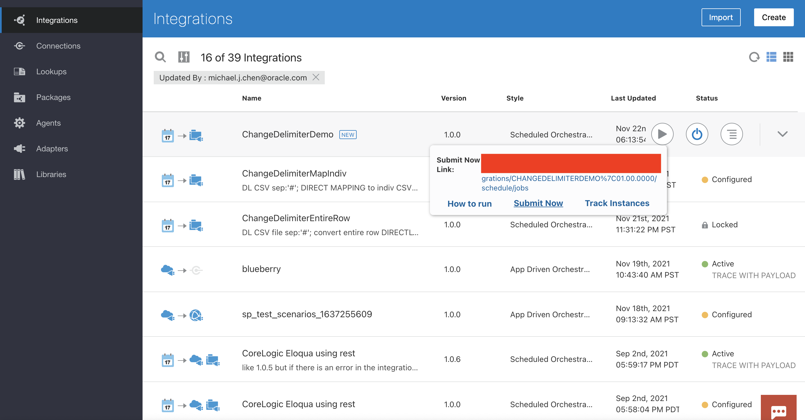

# How to Read a CSV File using a Different Delimiter

## Introduction

In this guide, I will show how to read a CSV file using a different **column** delimiter than the presets available on the OIC FTP adapter. These are the space, comma, semicolon, tab, and pipe characters ` ,;	|`. Each (column) field may be optionally enclosed by these characters: double quote, single quote, parentheses, square bracket, curly brace, angle bracket, or pipe characters `"'()[]{}<>|`. Finally, each row is terminated by the END_OF_LINE character, newline, carriage return, or both `${eol}` `\n` `\r` `\r\n`.

Normally, a CSV file will use commas, double quotes, and `${eol}` as its column delimiter, field separator, and row delimiter: `person.csv`

```
Fname,Lname,email,phone,BID
Alice,Sundayala,alice.sundayala@email.com,3004005000,1
Brent,Markleson,brent.markleson@email.com,1002003000,1
Craig,Stromdell,craig.stromdell@email.com,3101234567,4
Dylan,Renderman,dylan.renderman@email.com,8857713312,2
Ellie,Heartford,ellie.heartford@email.com,3005006000,1
Franz,Guillermo,franz.guillermo@email.com,1311411511,3
Grant,Zapanicca,grant.zapanicca@email.com,3104456667,4
Haley,Riverbend,haley.riverbend@email.com,8851357900,2
```

In this guide, I will be working with the following CSV file: `personhash.csv`

```
Fname#Lname#email#phone#BID
Alice#Sundayala#alice.sundayala@email.com#3004005000#1
Brent#Markleson#brent.markleson@email.com#1002003000#1
Craig#Stromdell#craig.stromdell@email.com#3101234567#4
Dylan#Renderman#dylan.renderman@email.com#8857713312#2
Ellie#Heartford#ellie.heartford@email.com#3005006000#1
Franz#Guillermo#franz.guillermo@email.com#1311411511#3
Grant#Zapanicca#grant.zapanicca@email.com#3104456667#4
Haley#Riverbend#haley.riverbend@email.com#8851357900#2
```

where the column delimiter has been replaced by a hash symbol `#`.

## Auxiliary Information

This guide was written on November 22, 2021. The version of OIC that was used to create these integrations was version 21.4.2.

## Assumptions

This guide assumes the following:
- The CSV file originates from a file server and is accessed via the FTP adapter.
- The file does NOT contain delimiter characters that you will be using to replace the existing delimiter characters. For instance, if you wish to replace `A#B#C#D#E, Euler's Number\r\n` with `A,B,C,D,E, Euler's Number\r\n` the extra comma before ` Euler's` will result in this row of data having six fields instead of five. For a more detailed discussion on how to handle these situations, see [this section](#Advanced-Methods-for-Parsing-Existing-Delimiter-Characters).

## Prerequisites

Please make sure you understand the following concepts prior to reading this guide. The details for performing the following will not be written in this guide.
- How to provision and administer your OIC instance
- How to navigate to your OIC homepage
- Where to create connections
- Where to create integrations
- How to activate/deactivate integrations
- Where to monitor integration jobs

This guide is meant for **somewhat experienced OIC users**, meaning users know how to do each of the above and have done them at least once.

## Create the FTP Connection

Navigate to your OIC home page and click **Integrations > Connections** on the left hamburger menu. Click the **Create** button in the upper right corner to create a connection. Search for and select the **FTP** adapter. Give it a name and click **Create**.

Add all the necessary details for your FTP adapter. It must have at least the FTP host address, server port, and credentials for accessing it, which is either username/password or RSA key. The FTP connection provided in the `ChangeDelimiter.par` package connects to an OIC file server using the SFTP protocol.

# Methods

## Method 1: Change Entire Row

In this method, I will download the file from the file server, then use the following pseudocode mapping to map each entire row to a new entire row where all old delimiters are replaced by new ones:

```
create-delimited-string(
	create-nodeset-from-delimited-string(
		$qname,
		$some_delimited_string,
		$old_delimiter_character
	), $new_delimiter_character
)
```

Explanation for variables:
- `$qname`: a string of the form `{a}b` or `a:b` which represents a namespace. The first form generally looks something like `{http://test.com/xmlns}value` and the second one could be `namespace:value`.
- `$some_delimited_string`: a string that contains row data. This could be something like `A#B#C#D#E`. This will also generally be passed in as a variable.
- `$old_delimiter_character`: a single character that separates all the fields in `$some_delimited_string`. In this example it would be `#`.
- `$new_delimiter_character`: a single character to replace `$old_delimiter_character`. Maybe I want my row data to look like `A,B,C,D,E`, meaning this character should be `,`.

```
create-delimited-string(
	create-nodeset-from-delimited-string(
		'{http://test.com/xmlns}value',
		'A#B#C#D#E',
		'#'
	), ','
)
```

### Step 1.1: Create Integration

Navigate to your OIC home page and click **Integrations > Integrations** on the left hamburger menu. Click the **Create** button in the upper right corner to create an integration. Choose the **Scheduled** orchestration pattern. Give it a name and click **Create**.

### Step 1.2: Read File

In this step, you will add the FTP connection to the integration canvas and configure it to read a file from FTP. This file (and the directory where it is located) can be passed in dynamically.

On the canvas, click the plus sign on the arrow between the schedule icon and the stop icon.


Select the FTP connection you created. Give the endpoint a name that describes its purpose best (ReadFile).


Choose **Read a File** for the operation and **Binary** for transfer mode. You may optionally add the Input Directory and File Name, but since nearly any use case using this method will pass in these fields dynamically, you should submit the file name and directory values in the mapper.


Choose **Yes** for specifying file schema and **CSV** for schema type.


For the file selection, upload the **one.csv** file provided in this repository. Enter **row** for the record name and **rowSet** for the recordSet name; these are just variable names that the mapper will use to organize source/target payloads. Leave everything else as the default.


Click **done** and open the mapper that spawned for the FTP connection.


Expand **FileReadRequest** on the target side, then right-click on the text for **filename** and choose **Create Target Node**. This will open an expression editor at the bottom of the screen where you can hard-code the variable for now. Click on the wrench-screwdriver icon in the lower right corner to edit. Do the same for **directory**. _In production use cases, the variable will most likely be a complex mapping and concatenation._


**Validate** the mapping, then **Save** your integration.


### Step 1.3: Write File

In this step, you will add the FTP connection to the integration canvas and configure it to write a file to FTP. ***This step need not send the file to FTP. It is possible to write it locally to OIC's temporary storage using the Stage File action. I am using FTP so that I can view the file contents in the FTP server when the file has been transformed.***

On the canvas, click the plus sign on the arrow between the stop icon and the FTP element before it.


Select the FTP connection you created. Give the endpoint a name that describes its purpose best (WriteFile).


Choose **Write File** for the operation and **Binary** for the transfer mode. For the output directory and file name pattern, you may add anything you wish here since you can overwrite it again using the mapper.


Choose **Yes** for specifying file schema and **CSV** for schema type.


For the file selection, upload the **one.csv** file provided in this repository. Enter **row** for the record name and **rowSet** for the recordSet name. Leave everything else as the default.


Click **done** and open the mapper that spawned for the FTP connection.


Expand **OutboundFTPHeaderType** on the target side, then create a target node for and open the expression editor for **fileName**. You may configure any name or directory, just make sure the directory exists. I am writing `newperson.csv` to `/inbound`.


**Validate** the mapping, then **Save** your integration.


### Step 1.4: Define Mapping

In this step, you will apply the mapping to change the delimiter character in each row to the desired delimiter character. For a more advanced discussion on what to do if the new delimiter character already exists in the row data, see [this section](#Advanced-Methods-for-Parsing-Existing-Delimiter-Characters).

Open the second mapper.


Expand **rowSet > row > header** on the target side. Create a target node and open the expression editor for **header**.


Click this button to expand the functions panel.


Expand **Functions > String** and drag **create-delimited-string** to the expression editor. Navigate your cursor to the first field. _create-delimited-string is a function with two arguments: `nodeset` and `delimiter`. It concatenates all elements of the `nodeset` into a string, separated by the `delimiter`._


Expand **Functions > Advanced** and drag **create-nodeset-from-delimited-string** to the expression editor. The function will be inserted where your cursor is. _create-nodeset-from-delimited-string is a function with three arguments: `qname`, `delimitedString`, and `delimiter`. It separates `delimitedString` into an XML object defined by `qname` by the `delimiter` character._


Fill out the function arguments. The first argument for `create-nodeset-from-delimited-string` should be `"{}value"`. The third argument for `create-nodeset-from-delimited-string` should be `"#"`. The second argument for `create-delimited-string` should be `","`. The effect of these parameter assignments is that any `#` in the input string will be replaced with a `,`. If this transformation were processed into an XML document, it will have a null namespace followed by a list of `value` elements. Navigatee your cursor to the second argument position for `create-nodeset-from-delimited-string`.


Expand **ReadFile Response (FTP) > SyncReadFileResponse > FileReadResponse > rowSet > row > header**. Drag **header** from the source side to the expression editor. Click the check mark under the wrench/screwdrive ricon to save this expression to the mapper (circled).


Finally, drag **row** from the source side to **row** on the target side. This creates a for-each loop so that each row (a repeating element) is processed instead of just the first one. You can see this for-each loop by clicking the XSLT button (circled).


**Validate** the mapping, then **Save** the integration. The complete string generated is the following, **which may not be the same as the one you generate due to differing namespaces.**
```
oraext:create-delimited-string ( oraext:create-nodeset-from-delimited-string ( "{}value" ,  $ReadFile/nsmpr1:SyncReadFileResponse/ns21:FileReadResponse/ns20:rowSet/ns20:row/ns20:header  , "#" ) , "," )
```

### Step 1.5: Activate and Test

In the FTP server that the FTP connection points to, make sure the `personhash.csv` file is in the directory configured in step 2. Also, make sure the directory in step 3 exists, and that the user connected to the provided credentials has read access to the step 2 directory and write access to the step 3 directory.

You will need to configure a tracking variable prior to activating the integration. Click the hamburger menu under the Save button, then Tracking.


Drag **startTime** to the right, or click **startTime** and then click the right chevron button (circled). Save, then **Save** your integration.


Now you may activate the integration without scheduling. You should **Enable Tracing** and **Include Payload** in case something fails. Once you have done so and the integration is active, click the "play" button, then **Submit Now**.


**Ad Hoc** request should already be selected. Click **Submit Now**. Check both the OIC monitoring page for **Tracking** and the FTP server for the new file. You will notice that it has been changed to a CSV file with each `#` replaced with a `,`.

## Method 2: Map Parsed Row to Individual Target Elements

In this method, I will download the file from the file server, then use the following pseudocode mapping to parse each row to generate a node set where I can then specify an XSLT mapping. First, I will show the XSLT code for the important mapper of the previous method:


This code shows that `ns23:row` will contain exactly one column, called `ns23:header`. The original CSV file contains five columns that can actually be mapped under `ns23:row`.

If you wish to skip steps 2.1-2.2, you can clone the integration created from method 1 and destroy any existing mappings. Otherwise, they are identical to the steps in method 1, and you may refer to them there.

### Step 2.1: Create Integration

Same as [above](#Step-1.1:-Create-Integration).

### Step 2.2: Read File

Same as [above](#Step-1.2:-Read-File).

### Step 2.3: Write File

Same as [above](#Step-1.3:-Write-File), except for choosing the file selection: choose **person.csv** instead of **one.csv**. The reason for this is that it allows the input payload for writing to the CSV file to generate nodes for each of the fields in the CSV file. Everything else is the same.


### Step 2.4: Define Mapping

In this step, you will apply an XSLT transformation that takes each row, splits it into each field separated by the existing delimiter, then maps each of those fields to the target side.

Open the second mapper. Apply any filename/directory transformations you want.


On the source side, expand **ReadFile Response (FTP) > SyncReadFileResponse > FileReadResponse > rowSet > row**. On the target side, expand **rowSet > row**. Drag **row** over to **row**.


You will need to generate XSLT code for the next step to simplify things - the alternative is for you to write a lot of XSLT code, which greatly increases the chance of an error. You will create a target node for each of the sub-elements under **row** on the target side.


Now you will modify the XSLT to parse out the node set as a variable and access its contents in the same mapper. Click **Code** (circled) and scroll to the bottom. Your code should look similar to this screenshot:


Under the `xsl:for-each` element in the XSLT code (line 50), add this code:
```
<xsl:variable name="var1" select="oraext:create-nodeset-from-delimited-string (&quot;{}value&quot;, ns25:header, &quot;#&quot; )"/>
```
What this code does is it creates a new XSL variable called `var1` (accessed via `$var1`) with the value of the node set created by the `select` attribute. You may need to replace the `ns25:header` string depending on if the namespace was changed. You can test this by validating the mapping. If the mapping is not valid, you can check which namespace **header** has by mapping **header** from the source side to any target node.


Now you will need to insert an `xsl:value-of` operator for each one of the columns like `<ns23:Fname/>`. You may do so by replacing `<ns23:Fname/>` with `<ns23:Fname><xsl:value-of select="$var1[X]"/></ns23:Fname>` where `X` is the index of the node to get. Since XSL node sets are 1-indexed, Fname is `"$var1[1]"`, Lname is `"$var1[2]"`, and so on. Once your mapping is complete, it should look something like this:


The above mapping basically says: For each **row** from **ReadFile Response**, map the first element of the node set **var1** to **Fname** from target; second element of the node set **var1** to **Lname**, etc. WHERE **var1** is a node set created by splitting the **row/header** of **ReadFile Response** by the delimiter character `#`. **Validate** the mapping, then **Save** your integration. _If you try to re-enter the mapper, it will now only display the code view since OIC does not currently support displaying XSLT variables in graphical view._

### Step 2.5: Activate and Test

See [above](#Step-2.5:-Activate-and-Test) for more detailed instructions.

Prior to completing this step, you may want to remove the newly generated file in FTP if the name of the new file generated by this integration is the same file generated by the Method 1 integration.

If necessary (you have an error related to a tracking field), apply the tracking variable for the integration (use startTime). Save and close, then activate the integration. Finally, choose **Submit Now** twice. Check your file server and **Tracking** to see the file that is generated - it should be the exact same as `person.csv` and the file generated by the Method 1 integration.

## Advanced Methods for Parsing Existing Delimiter Characters

## Closing

sdfjl


